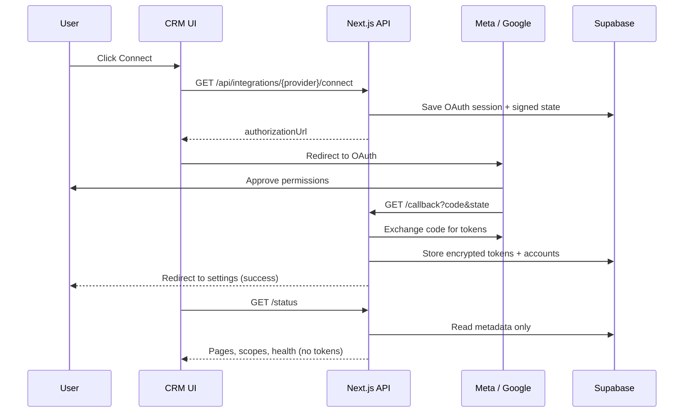
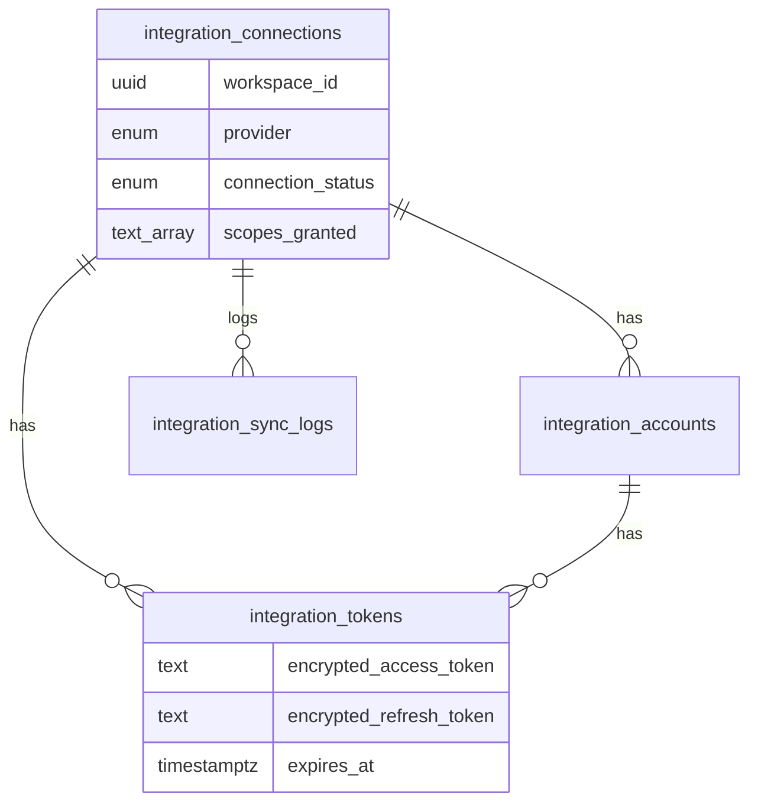

# Meta & Google Integrations for CRM

Production-ready OAuth integrations for a **multi-tenant CRM**: each workspace connects its own Meta (Facebook Pages, Instagram Business) and Google (Calendar, Meet) accounts.

Tokens never reach the browser. They are encrypted and stored server-side only.

---

## Table of contents

1. [What this does](#what-this-does)
2. [How it works](#how-it-works)
3. [Architecture](#architecture)
4. [Database](#database)
5. [Setup guide](#setup-guide)
6. [Environment variables](#environment-variables)
7. [API reference](#api-reference)
8. [Security model](#security-model)
9. [End-user experience](#end-user-experience)
10. [Testing](#testing)
11. [Documentation](#documentation)

---

## What this does

| Provider | Capabilities |
|----------|----------------|
| **Meta** | Facebook Login, Page selection, Page access tokens, Instagram Business detection, webhooks |
| **Google** | OAuth with offline access, Calendar + Meet (via Calendar API), optional Gmail (feature-flagged), calendar push watches |

Each **workspace** (tenant) has its own connections. One workspace cannot read another’s integration data.

Built for:

- Minimal OAuth scopes (faster App Review / Google verification)
- Reconnect flows when tokens expire or are revoked
- Customer-facing status (connected, missing permissions, needs reconnect)
- App Review and Google verification readiness

---

## How it works

High-level flow from your customer’s perspective:

1. User opens **Settings → Integrations** in the CRM.
2. They click **Connect Meta** or **Connect Google**.
3. The app redirects them to the provider to approve permissions.
4. The provider redirects back to your server (**callback** route).
5. The server exchanges the code for tokens, encrypts them, and saves metadata in Supabase.
6. The UI shows connected Pages / accounts, scopes, and any warnings—**without** exposing tokens.



### Meta-specific behavior

- **PKCE** + signed **state** (workspace + user) prevent CSRF and cross-tenant mix-ups.
- Short-lived user token → **long-lived user token** → **Page access tokens** per managed Page.
- Linked **Instagram Business** accounts are detected via Graph API and listed separately.
- **Webhooks** verify `X-Hub-Signature-256`, persist events with an idempotency key, then process safely.

### Google-specific behavior

- **`access_type=offline`** so refresh tokens can be stored (encrypted).
- **`prompt=consent`** when a refresh token is missing (reconnect path).
- **Incremental scopes** via `include_granted_scopes` when adding modules later.
- **Calendar watch** (`/watch`) registers push notifications to `/webhook`.
- **Meet links** are created through Calendar `conferenceData` (no separate Meet OAuth scope).
- **Gmail** is off by default (`FEATURE_GOOGLE_GMAIL=false`) until Google restricted-scope verification is done.

---

## Architecture

### Stack

| Layer | Technology |
|-------|------------|
| Frontend | React (Next.js App Router) |
| API | Next.js Route Handlers (`/api/integrations/...`) |
| Database & Auth | Supabase PostgreSQL + Auth |
| Language | TypeScript (strict) |
| Observability | Sentry + structured JSON logs |
| Secrets | AES-256-GCM for tokens at rest |

### Project layout

```
├── src/
│   ├── app/
│   │   ├── api/integrations/     # OAuth + webhooks (server-only)
│   │   └── settings/integrations # Customer-facing UI
│   ├── components/integrations/  # Connect / status panels
│   ├── lib/
│   │   ├── auth/                 # Session + workspace context
│   │   ├── crypto/               # Token encryption
│   │   ├── oauth/                # Signed state + PKCE
│   │   └── errors/               # Provider error → safe messages
│   └── services/integrations/    # Meta & Google business logic
├── supabase/migrations/           # Schema + RLS
└── docs/                         # Setup, audit, app review, customer guide
```

### Design rules

- **Provider logic lives in services**, not React components.
- **Graph API version** and OAuth URLs come from **environment variables** (not hardcoded).
- **Feature flags** gate Meta, Google, and Gmail without redeploying behavior blindly.
- **Status APIs** return metadata only; tokens are read only inside API routes via the Supabase **service role**.

### Multi-tenant isolation

- Every integration row includes `workspace_id`.
- **Row Level Security (RLS)** limits the `authenticated` role to its own workspace.
- Table `integration_tokens` has **no** policy for `authenticated`—only the server (service role) can read or write tokens.

---

## Database

Apply the migration:

```bash
# Using Supabase CLI (recommended)
supabase db push

# Or run manually in Supabase SQL Editor:
# supabase/migrations/20260530120000_integration_tables.sql
```

### Tables

| Table | Purpose |
|-------|---------|
| `integration_connections` | One row per workspace + provider (Meta or Google): status, scopes, errors |
| `integration_accounts` | Sub-accounts: Facebook Pages, Instagram Business, Google user |
| `integration_tokens` | Encrypted access/refresh tokens (**server-only access**) |
| `integration_oauth_sessions` | Short-lived OAuth state / PKCE verifiers |
| `integration_webhook_events` | Inbound webhook inbox with idempotency |
| `integration_sync_logs` | Audit trail: connect, disconnect, refresh, errors |

### Connection status values

| Status | Meaning |
|--------|---------|
| `connected` | Working |
| `needs_reconnect` | Refresh failed or offline access missing—user should reconnect |
| `error` | Provider error stored in `last_error_*` |
| `revoked` | Disconnected or access removed |

### Auth requirement

Supabase users must include a **workspace** identifier so RLS can enforce tenancy:

```json
{
  "app_metadata": { "workspace_id": "<uuid>" }
}
```

(or `user_metadata.workspace_id`—see `src/lib/auth/session.ts`).

When merging into an existing CRM, map your tenant/workspace ID to this claim.

### Entity relationship (simplified)



---

## Setup guide

### Prerequisites

- Node.js 20+
- A [Supabase](https://supabase.com) project
- [Meta Developer](https://developers.facebook.com/) app (for Facebook Login + Pages)
- [Google Cloud](https://console.cloud.google.com/) project with OAuth client + Calendar API enabled

### Step 1 — Clone and install

```bash
git clone <your-repo-url>
cd meta_google_integrations
npm install
```

### Step 2 — Environment file

```bash
cp .env.example .env.local
```

Generate secrets:

```bash
# 32-byte encryption key for tokens at rest
openssl rand -base64 32
# Use output for INTEGRATION_TOKEN_ENCRYPTION_KEY

# OAuth state signing secret (any strong random string, 16+ chars)
openssl rand -base64 24
# Use output for OAUTH_STATE_SECRET
```

Fill in Supabase, Meta, and Google values (see [Environment variables](#environment-variables)).

### Step 3 — Database

1. Open your Supabase project → **SQL Editor**.
2. Run `supabase/migrations/20260530120000_integration_tables.sql`.
3. Confirm tables appear under **Table Editor**.

### Step 4 — Supabase Auth

1. Enable your auth method (e.g. email, magic link, SSO).
2. Ensure new users receive `workspace_id` in JWT metadata (hook, trigger, or signup logic).
3. Keep **service role key** only on the server—never in the frontend.

### Step 5 — Meta app configuration

1. Create app → add **Facebook Login** product.
2. **Valid OAuth Redirect URIs:**  
   `https://<your-domain>/api/integrations/meta/callback`  
   (localhost URL for local dev—see `.env.example`)
3. Set **Webhook** callback URL:  
   `https://<your-domain>/api/integrations/meta/webhook`  
   and the same value as `META_WEBHOOK_VERIFY_TOKEN`.
4. Request only scopes your product uses (see `docs/meta-integration-setup.md`).

### Step 6 — Google Cloud configuration

1. Create OAuth 2.0 **Web application** client.
2. **Authorized redirect URI:**  
   `https://<your-domain>/api/integrations/google/callback`
3. Enable **Google Calendar API**.
4. Configure OAuth consent screen (Testing → Production after verification).
5. Details: `docs/google-integration-setup.md`.

### Step 7 — Run locally

```bash
npm run dev
```

Open:

- App home: http://localhost:3000  
- Integrations UI: http://localhost:3000/settings/integrations  

### Step 8 — Production checklist

- [ ] `NEXT_PUBLIC_APP_URL` set to production URL (HTTPS)
- [ ] OAuth redirect URIs match exactly in Meta/Google consoles
- [ ] `INTEGRATION_TOKEN_ENCRYPTION_KEY` rotated and stored in secrets manager
- [ ] `SUPABASE_SERVICE_ROLE_KEY` only on server
- [ ] Sentry `SENTRY_DSN` configured
- [ ] `FEATURE_GOOGLE_GMAIL=false` until Google restricted verification complete
- [ ] Review `docs/app-review-readiness.md` before going live

---

## Environment variables

| Variable | Required | Description |
|----------|----------|-------------|
| `NEXT_PUBLIC_APP_URL` | Yes | Public app URL (OAuth redirects, webhooks) |
| `NEXT_PUBLIC_SUPABASE_URL` | Yes | Supabase project URL |
| `NEXT_PUBLIC_SUPABASE_ANON_KEY` | Yes | Supabase anon key (client) |
| `SUPABASE_SERVICE_ROLE_KEY` | Yes | Server only—token DB access |
| `OAUTH_STATE_SECRET` | Yes | Signs OAuth `state` JWT |
| `INTEGRATION_TOKEN_ENCRYPTION_KEY` | Yes | Base64, 32 bytes—encrypts tokens |
| `META_APP_ID` | For Meta | Facebook app ID |
| `META_APP_SECRET` | For Meta | Server only |
| `META_OAUTH_REDIRECT_URI` | For Meta | Must match Meta app settings |
| `META_GRAPH_API_VERSION` | For Meta | e.g. `v21.0` |
| `META_WEBHOOK_VERIFY_TOKEN` | For Meta | Webhook verification string |
| `GOOGLE_CLIENT_ID` | For Google | OAuth client ID |
| `GOOGLE_CLIENT_SECRET` | For Google | Server only |
| `GOOGLE_OAUTH_REDIRECT_URI` | For Google | Must match Google console |
| `GOOGLE_WEBHOOK_CHANNEL_TOKEN` | Recommended | Validates Calendar push requests |
| `FEATURE_META_INTEGRATION` | No | Default `true`; `false` disables Meta |
| `FEATURE_GOOGLE_INTEGRATION` | No | Default `true`; `false` disables Google |
| `FEATURE_GOOGLE_GMAIL` | No | Default `false`; enable after verification |
| `SENTRY_DSN` | Optional | Error monitoring |

Full template: [`.env.example`](.env.example).

---

## API reference

All connect/status/disconnect routes require an authenticated Supabase session with `workspace_id`.

### Meta

| Method | Endpoint | Description |
|--------|----------|-------------|
| `GET` | `/api/integrations/meta/connect` | Returns `{ authorizationUrl }` |
| `GET` | `/api/integrations/meta/callback` | OAuth redirect handler (browser) |
| `GET` | `/api/integrations/meta/status` | Connection health, Pages, IG, scopes |
| `POST` | `/api/integrations/meta/disconnect` | Revokes local connection + tokens |
| `GET` | `/api/integrations/meta/webhook` | Meta subscription verification |
| `POST` | `/api/integrations/meta/webhook` | Receives Page/IG webhook events |

Query params for connect: `redirect_after` (optional URL after success).

### Google

| Method | Endpoint | Description |
|--------|----------|-------------|
| `GET` | `/api/integrations/google/connect` | Returns `{ authorizationUrl }` |
| `GET` | `/api/integrations/google/callback` | OAuth redirect handler |
| `GET` | `/api/integrations/google/status` | Account, modules, scopes, health |
| `POST` | `/api/integrations/google/disconnect` | Revokes tokens + deletes rows |
| `POST` | `/api/integrations/google/watch` | Registers Calendar push channel |
| `POST` | `/api/integrations/google/webhook` | Calendar push notifications |

Query params for connect:

- `modules` — comma-separated: `calendar`, `meet`, `gmail` (if enabled)
- `force_consent=true` — force refresh token on reconnect
- `redirect_after` — optional post-auth URL

### Example: check Meta status

```bash
curl -H "Cookie: <supabase-session-cookie>" \
  https://your-app.com/api/integrations/meta/status
```

Response shape (no tokens):

```json
{
  "provider": "meta",
  "connectionStatus": "connected",
  "scopesGranted": ["pages_show_list", "..."],
  "missingScopes": [],
  "needsReconnect": false,
  "accounts": [
    { "accountName": "My Page", "accountType": "facebook_page", "..." }
  ]
}
```

---

## Security model

| Topic | Approach |
|-------|----------|
| **Tokens in browser** | Never—status APIs and UI only see metadata |
| **Tokens in database** | AES-256-GCM encrypted; decrypted only in API services |
| **DB access from client** | RLS on metadata tables; token table blocked for `authenticated` |
| **OAuth CSRF** | Signed JWT `state` + one-time server session row |
| **Meta webhooks** | HMAC SHA-256 (`X-Hub-Signature-256`) |
| **Google webhooks** | Channel token header validation |
| **Duplicate webhooks** | Unique `(provider, idempotency_key)` |
| **Errors shown to users** | Normalized, non-technical messages |
| **Errors for engineers** | Sentry + structured logs (no token values) |

---

## End-user experience

Your customers use the built-in page:

**`/settings/integrations`**

| UI element | Behavior |
|------------|----------|
| Connect | Starts OAuth for that provider |
| Connected Pages / accounts | Loaded from `/status` |
| Missing permissions | Lists scopes still required |
| Needs reconnect | Warning + reconnect (Google) or disconnect + connect (Meta) |
| Disconnect | Removes tokens and connection for the workspace |
| Last sync / error | From `integration_sync_logs` and connection error fields |

Share [`docs/customer-connection-guide.md`](docs/customer-connection-guide.md) with clients for step-by-step connection help.

---

## Testing

```bash
# Unit tests (encryption, OAuth state, scopes, webhooks, errors)
npm test

# Production build
npm run build

# Lint
npm run lint
```

Manual smoke test:

1. Sign in with a user that has `workspace_id` in JWT.
2. Connect Meta → confirm Pages on status.
3. Connect Google → confirm email and scopes on status.
4. Disconnect each provider → status shows disconnected.

Provider-specific checklists: [`docs/integrations-audit.md`](docs/integrations-audit.md#12-testing-checklist).

---

## Documentation

| Document | Audience | Contents |
|----------|----------|----------|
| [`docs/integrations-audit.md`](docs/integrations-audit.md) | Engineering / compliance | Audit, risks, implementation plan |
| [`docs/meta-integration-setup.md`](docs/meta-integration-setup.md) | DevOps / developers | Meta app, scopes, webhooks |
| [`docs/google-integration-setup.md`](docs/google-integration-setup.md) | DevOps / developers | Google OAuth, Calendar, verification |
| [`docs/customer-connection-guide.md`](docs/customer-connection-guide.md) | **Your clients** | How to connect Meta & Google |
| [`docs/app-review-readiness.md`](docs/app-review-readiness.md) | Product / compliance | Meta App Review + Google verification |

---

## Merging into an existing CRM

This repo is a focused integration module. To embed it in your main app:

1. Copy `src/services/integrations`, `src/app/api/integrations`, components, and `lib` helpers.
2. Run the Supabase migration (or merge into your migrations).
3. Replace `requireAuthContext()` with your workspace membership check.
4. Add a background job to call `GoogleIntegrationService.refreshConnectionTokens()` before token expiry.
5. Point Meta/Google OAuth redirect URLs to your production domain.

---

## Scripts

| Command | Description |
|---------|-------------|
| `npm run dev` | Local development server |
| `npm run build` | Production build |
| `npm run start` | Start production server |
| `npm test` | Run Vitest tests |
| `npm run lint` | ESLint |

---

## Support & references

- [Meta access tokens](https://developers.facebook.com/docs/facebook-login/guides/access-tokens)
- [Google sensitive scope verification](https://developers.google.com/identity/protocols/oauth2/production-readiness/sensitive-scope-verification)
- [Google restricted scope verification](https://developers.google.com/identity/protocols/oauth2/production-readiness/restricted-scope-verification)

---

**License:** Use according to your organization’s policy for this repository.
