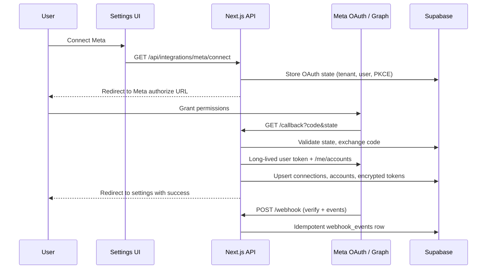
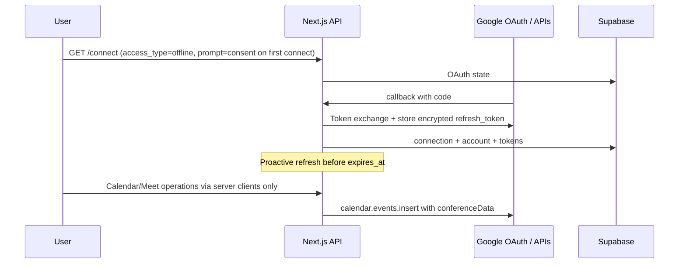

# Meta & Google Integrations — Audit Report

**Audit date:** 2026-05-30  
**Repository:** `meta_google_integrations`  
**Mode:** Audit-first (greenfield baseline)

---

## Executive summary

This repository contained **no prior CRM or integration implementation** at audit time—only an initial `README.md`. There were no Next.js routes, Supabase migrations, OAuth handlers, token storage, webhooks, or integration UI.

This audit documents:

1. The **expected** integration surface for a multi-tenant CRM (from product requirements).
2. **Gaps** versus production-ready Meta/Google integrations.
3. A **recommended architecture** and implementation plan used to build the scaffold in this branch.

All “current flow” sections below describe the **pre-implementation baseline (none)** and the **target design** now being introduced.

---

## 1. Current Meta integration flow

### Baseline (pre-implementation)

| Area | Status |
|------|--------|
| `/api/integrations/meta/connect` | Missing |
| `/api/integrations/meta/callback` | Missing |
| `/api/integrations/meta/status` | Missing |
| `/api/integrations/meta/disconnect` | Missing |
| `/api/integrations/meta/webhook` | Missing |
| Facebook Login OAuth | Missing |
| Page access tokens | Missing |
| Long-lived token exchange | Missing |
| Instagram Business detection | Missing |
| Customer settings UI | Missing |

### Target flow (implemented in this branch)

**Scopes (minimal, env-configurable):**

- `pages_show_list`, `pages_read_engagement` — page listing and basic engagement reads
- `pages_manage_metadata` — webhook subscription management (when enabled)
- `instagram_basic`, `instagram_manage_insights` — Instagram Business/Creator linkage (optional module flag)

Graph API version is read from `META_GRAPH_API_VERSION` (never hardcoded in code).

---

## 2. Current Google integration flow

### Baseline (pre-implementation)

| Area | Status |
|------|--------|
| Google OAuth connect/callback/status/disconnect | Missing |
| Offline refresh tokens | Missing |
| Calendar / Meet / Gmail modules | Missing |
| `/api/integrations/google/watch` | Missing |
| `/api/integrations/google/webhook` | Missing |
| Customer settings UI | Missing |

### Target flow (implemented in this branch)

**Scopes (minimal, modular via env):**

- `openid`, `email`, `profile` — account identity
- `https://www.googleapis.com/auth/calendar` — Calendar read/write (Meet via `conferenceData`)
- `https://www.googleapis.com/auth/gmail.readonly` — only when `GOOGLE_ENABLE_GMAIL=true`

Gmail is **disabled by default** to reduce Google verification surface.

---

## 3. OAuth redirect / callback issues

### Findings (baseline)

- No redirect URIs registered in code.
- No `state` validation → CSRF risk if built naively.
- No tenant binding on callback → cross-tenant connection risk.

### Mitigations (target)

| Issue | Fix |
|-------|-----|
| CSRF | Signed/random `state` stored server-side with TTL; validated on callback |
| Tenant confusion | `workspace_id` + `user_id` embedded in state payload (server-only) |
| Redirect mismatch | `META_REDIRECT_URI` / `GOOGLE_REDIRECT_URI` must match developer console exactly |
| Open redirect | Callback redirects only to `APP_URL` paths allowlisted in env |
| PKCE (Meta) | Optional via `META_OAUTH_USE_PKCE=true`; verifier stored with state |
| Google incremental auth | `include_granted_scopes=true`; reconnect uses `prompt=consent` when refresh missing |

---

## 4. Scope problems

### Meta

| Risk | Recommendation |
|------|----------------|
| Over-broad permissions | Request page/IG scopes only; avoid `ads_management` unless product needs ads |
| App not in Live mode | Document review requirements; map Graph error `190`, `#200` to user-safe messages |
| Page vs user token confusion | Store **page** tokens on `integration_accounts`; user token only for exchange |

### Google

| Risk | Recommendation |
|------|----------------|
| Restricted scopes (Gmail) | Keep Gmail behind feature flag; default off |
| Missing refresh token | Force `prompt=consent` on first connect; detect absent `refresh_token` → `needs_reconnect` |
| Calendar-only verification | Ship Calendar+Meet first; add Gmail after verification |

---

## 5. Token storage / refresh problems

### Findings (baseline)

- No encryption, no expiry tracking, no refresh jobs.

### Target design

| Concern | Approach |
|---------|----------|
| Frontend exposure | **Never** return access/refresh tokens to client; status API returns metadata only |
| Storage | `integration_tokens` with `access_token_ciphertext` / `refresh_token_ciphertext` via AES-256-GCM (`TOKEN_ENCRYPTION_KEY`) |
| Access pattern | `createServiceRoleClient()` in API routes only |
| RLS | Policies allow tenant members to read **connection metadata**; token columns excluded from client SELECT grants |
| Meta refresh | Exchange long-lived token before expiry; page tokens refreshed via user token |
| Google refresh | Refresh access token when `expires_at - now < 5 minutes`; missing refresh → `needs_reconnect` |
| Revocation | Disconnect clears tokens and sets `connection_status = revoked` |

---

## 6. Webhook problems

### Findings (baseline)

- No webhook endpoints, no verification, no idempotency.

### Target design

| Provider | Verification | Persistence |
|----------|--------------|---------------|
| Meta | `hub.verify_token` challenge; `X-Hub-Signature-256` HMAC | `integration_webhook_events` with `idempotency_key` |
| Google | Channel token + resource ID on push notifications | Same table; watch renewal via `/watch` |

**Retry-safe processing:** insert event with unique `(provider, idempotency_key)`; duplicate inserts ignored; `processed_at` updated after handler success.

---

## 7. Multi-tenant data isolation risks

### Findings (baseline)

- No schema → total isolation gap.

### Requirements enforced

- All integration tables include `workspace_id` (tenant key).
- RLS: `workspace_id IN (SELECT workspace_id FROM workspace_members WHERE user_id = auth.uid())`
- OAuth state rows scoped to `workspace_id`.
- API routes resolve workspace from session + membership check before connect/callback.
- Service role used only server-side; never shipped to browser.
- Webhook handlers resolve tenant via `provider_account_id` / page ID mapping—not query params from client.

### Residual risks

| Risk | Mitigation |
|------|------------|
| IDOR on status endpoint | Require auth + workspace header/session |
| Webhook tenant spoofing | Map external IDs only through DB lookup |
| Leaked service role key | Env-only; rotate; Supabase IP restrictions in production |

---

## 8. App review / Google verification risks

### Meta (Facebook Login + Pages + Instagram)

- **Development mode** limits test users; production requires App Review for each permission.
- Business verification may be required for advanced access.
- Data Use Checkup and Privacy Policy URL must be configured.
- Document each scope justification in `docs/app-review-readiness.md`.

### Google

- **Sensitive/restricted scopes** (Gmail) trigger verification and security assessment.
- OAuth consent screen: External → Testing (100 users) → Production verification.
- Use **minimum scopes**; incremental authorization for new modules.
- Store demo video script and scope justification per Google checklist.

---

## 9. Sentry / logging gaps

### Baseline

- No Sentry, no structured logs.

### Target

- `@sentry/nextjs` with tunnel route optional.
- Breadcrumbs on OAuth start, callback, token refresh, webhook receive.
- `integration_sync_logs` for connect/disconnect/refresh outcomes.
- PII scrubbing: never log tokens, only `token_id` / `connection_id` prefixes.
- Provider errors normalized via `ProviderError` type with `customerMessage` safe for UI.

---

## 10. Recommended fixes (priority)

| P | Item |
|---|------|
| P0 | Supabase schema + RLS + encrypted token columns |
| P0 | Server-only OAuth routes with state validation |
| P0 | Status/disconnect APIs returning no secrets |
| P1 | Meta long-lived + page token pipeline |
| P1 | Google offline refresh + proactive refresh |
| P1 | Webhook verify + idempotent persistence |
| P2 | Settings UI (connect, reconnect, scopes display) |
| P2 | Feature flags: `INTEGRATIONS_META_ENABLED`, `INTEGRATIONS_GOOGLE_ENABLED` |
| P3 | Background jobs for token refresh and Google watch renewal |
| P3 | App Review documentation package |

---

## 11. Implementation plan

### Phase A — Foundation (this PR)

- [x] Audit document
- [x] Supabase migration `001_integration_tables.sql`
- [x] Shared libs: crypto, oauth-state, provider clients, errors
- [x] Meta + Google API route handlers
- [x] Settings UI pages
- [x] Unit/integration tests (Vitest)
- [x] Operator + customer documentation

### Phase B — Production hardening (follow-up PR)

- [ ] Supabase Edge Function or cron for token refresh
- [ ] Meta webhook field subscriptions per page
- [ ] Google Calendar `events.watch` renewal scheduler
- [ ] Rate limiting on OAuth callbacks
- [ ] Audit log export for compliance

### Phase C — CRM product wiring

- [ ] Link leads/conversations to `integration_accounts`
- [ ] Sync workers reading `integration_sync_logs`
- [ ] Per-tenant integration entitlements

---

## 12. Testing checklist

### Meta

- [ ] OAuth success with valid state
- [ ] Reject invalid/expired state
- [ ] Missing scopes → `connection_status=error`, `scopes_required` populated
- [ ] Expired token → refresh or `needs_reconnect`
- [ ] Page token stored per selected page
- [ ] Instagram Business account detected on linked page
- [ ] Webhook verification (`hub.challenge`)
- [ ] Webhook signature validation failure → 401
- [ ] Webhook event idempotency (duplicate delivery)
- [ ] Reconnect flow clears error and re-authorizes

### Google

- [ ] OAuth success; refresh token persisted
- [ ] First connect without refresh → `needs_reconnect` + prompt consent
- [ ] Token refresh updates `expires_at`
- [ ] Revoked refresh → `needs_reconnect`
- [ ] Calendar event create/read (server client)
- [ ] Meet link via `conferenceData.createRequest`
- [ ] Gmail module skipped when flag off
- [ ] Watch channel registration
- [ ] Quota exceeded → normalized error + sync log
- [ ] Reconnect flow

### Security

- [ ] Tokens never appear in browser network responses
- [ ] Cross-tenant access blocked by RLS
- [ ] Encryption round-trip for token helper

---

## 13. Customer-facing setup notes

### Meta

1. Workspace admin opens **Settings → Integrations → Meta**.
2. Click **Connect**; log in with Facebook account that manages target Pages.
3. Grant requested permissions; select Pages if prompted post-connect.
4. If **Needs reconnect** appears, permissions were revoked or token expired—click **Reconnect**.
5. Instagram Business accounts appear when linked to a connected Page.

### Google

1. Open **Settings → Integrations → Google**.
2. Click **Connect**; choose Workspace Google account.
3. Enable modules shown (Calendar, Meet; Gmail only if org allows).
4. If Gmail is required, admin must complete Google verification first.
5. **Needs reconnect** means sign-in again with consent to issue a new refresh token.

### Support escalations

| Symptom | Likely cause |
|---------|----------------|
| "App not active" (Meta) | App in Development mode or review pending |
| "Insufficient permissions" | Reconnect and accept all listed scopes |
| Google "Access blocked" | OAuth consent screen not published / test users only |
| No refresh token | User must reconnect with consent prompt |

---

## Appendix: Files introduced in this branch

| Path | Purpose |
|------|---------|
| `supabase/migrations/001_integration_tables.sql` | Schema + RLS |
| `src/lib/integrations/**` | Provider services, crypto, OAuth state |
| `src/app/api/integrations/meta/**` | Meta routes |
| `src/app/api/integrations/google/**` | Google routes |
| `src/app/settings/integrations/**` | Customer UI |
| `docs/meta-integration-setup.md` | Operator setup |
| `docs/google-integration-setup.md` | Operator setup |
| `docs/customer-connection-guide.md` | End-user guide |
| `docs/app-review-readiness.md` | Review checklist |

---

*This audit should be re-run after merging into the main CRM monorepo to diff against any existing integration code there.*
